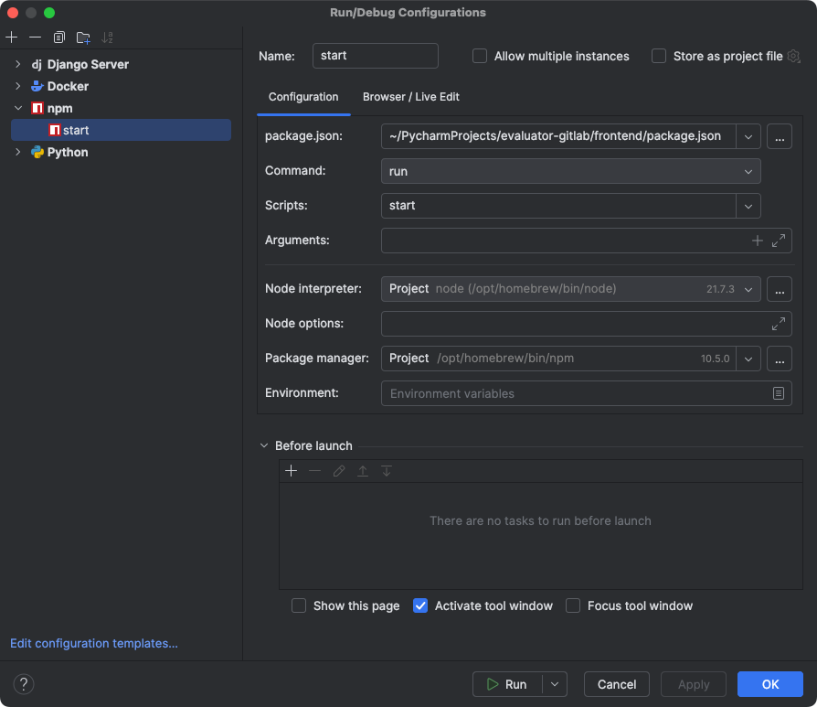
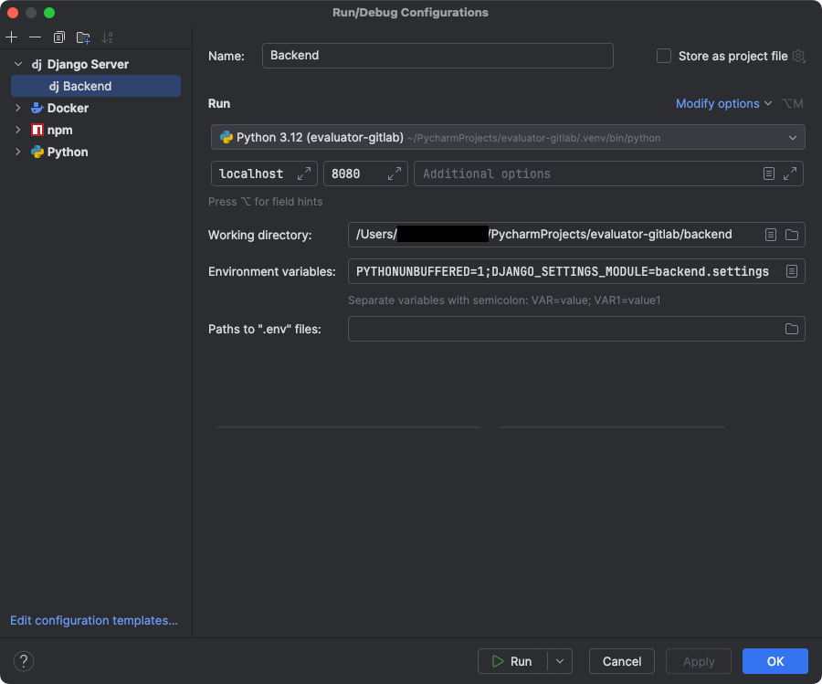

# Evaluator V2

## Frontend (Angular)

### Run 

## Backend (Django)

### Run

## Database (Postgres)

## Docker

On the server dangling docker images are stored and can fill up the disk space. Identify them 
`docker images -f "dangling=true"`, you can see  the disk space with `docker system df`. Remove them with 
`docker system prune`.

## Environment
The _.env_ must include the following variables:
- BUILD_MODE
- PG_PATH
- PG_DB
- PG_DB_USER
- PG_DB_PW
- PG_HOST
- PG_PORT
- SECRET_KEY
- DEBUG
- DJANGO_SETTINGS_MODULE
- CORS_ALLOWED_ORIGINS
- ALLOWED_HOSTS
